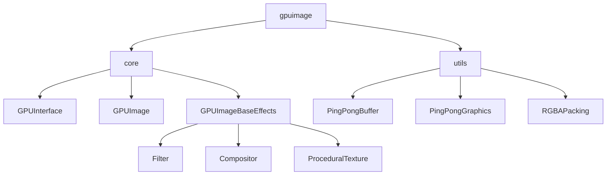

# GPUImage
Processing library for high-performance image computing and GPGPU computing (GLSL).

| Plateforme : 	| Status:		|
|---------------|---------------|
| **`Windows`** |  |
| **`OSX`** 	|  |
| **`Linux`** 	|  |

## Features

## Informations and major updates
- The v.0.0.1 the library is build on the top of processing which means we are using processing class such as PGraphics, Pimage, PApplet...
- The v.0.0.1 is based on the processing PJOGL profile. There is no change in the GL context and it's still build on GL2ES2 (a version between GL2, GL3 and GLES2) [GL2ES2 JOGAMP](https://download.java.net/media/jogl/jogl-2.x-docs/javax/media/opengl/GL2ES2.html)
- **Because the library relies on the PJOGL profile (GL2ES2) all shaders are based on GLSL 1.50 (150) [GLSL versions table](https://www.opengl.org/discussion_boards/showthread.php/199965-picking-a-glsl-version)**
- #11 The effect effector system is design as a a base component : **GPUImageBaseEffects** which is extends by 3 differents class : **Filter**, **Compositor** and **ProceduralTexture**. Each of them is based on the ping pong buffer system set in the **GPUImageBaseEffects**. Each of them can take cares of differents actions :
	- **Filter** : All filtering and VFX operations on a single image (chromawarp, blur, sobel...)
	- **Compositor** : Composition between two images (mask, blending...)
	- **ProceduralTexture** : Generation of procedural texture (noise, FBM, voronoi...)

## %"Design Pattern"


## To do
### Global
- [ ] Add try catch and handle errors
- [ ] Add custom throw error (view adidas source)
- [ ] Add avatar @gitlab

### Core 
- [x] Library info
- [x] simple GPU info
- [ ] custom GPU info (memory size...)

### %"PingPong Buffer"
PingPong buffer is an utils class allowing you to create a ping pong buffer in order to make read-write texture pipeline by creating 2 buffers

- [x] Processing ping pong buffer using PGraphics
Each buffer can be swapped so the second is always a previous version of the first one. 
The main idea of this class is to keep the paradigm of an offscreen buffer made in processing using PGraphics through the PinPongBuffer object. User does not have to learn an new offscreen drawing implementation with various context and drawing methods. Drawing can be handle using
```java
object.dst.beginDraw();
object.dst.endDraw();
```

- [x] Trying extend PGraphics in order to create a simple PingPongBuffer → ref :
* [Extending PGraphics (p5 forum)](https://forum.processing.org/two/discussion/5238/creating-a-layer-class-that-extends-pgraphics)
* [Extending Pgraphics (2) (p5 forum)](https://forum.processing.org/two/discussion/6884/question-about-pgraphics#Item_3)
* [Praxis implementation](https://github.com/praxis-live/praxis/blob/master/praxis.video.pgl/src/org/praxislive/video/pgl/PGLGraphics.java)
**WIP**
Processing ping pong buffer extending PGraphicsOpenGLClass
The class extends the PGraphicsOpenGL class in order to have the same drawing methods. At each swap the main buffer is copied into the prebious buffer using arrayCopy. User can draw into the PingPongGraphics using all the PGraphics methods
```java
object.beginDraw();
object.endDraw();
```
This methods is a test methods only. We need to make a benchmark in order to define the best solution.
**NB : Tested on a filter methods inside a forloop, this method is too slow on the arrayCopy() (30 fps at 60 iterations) vs the previous one (60 fps at 60 iterations)**

- [ ] independant ping pong buffer (custom JOGL implementation) for Floating Point Texture

### %"Filtering/Compositor/Procedural Texture"

#### GPUImageBaseEffects

#### Filter extends GPUImageBaseEffects

##### Denoiser/Blur/Filtering
- [x] Bilateral
* * [x] Debugger le filtre GLSL (Inversion d'UV)
- [ ] Bicubic
- [x] Simple Denoise
* * [x] set custom param binding to shader
- [x] Median 3×3 (TBD : iteration avec PingPong Buffer)
- [x] Median 5×5 (TBD : iteration avec PingPong Buffer) 
- [ ] Edge detection + Sobel + Canny

##### Blur
- [x] Gaussian
* * [x] set custom param binding to shader
- [x] Fast Blur 5x5, 7x7, 9x9, 13x13
- [ ] Radial blur

##### Color :
- [x] Contrast/Sat/Bright
- [ ] Desaturate
- [x] Level
- [x] Gamma
* * [x] set custom param binding to shader
- [ ] LUT
- [ ] High-Passing
- [ ] Threshold

##### Effect/VFX :
- [x] ChromaWarp
* * [x] set custom param binding to shader
- [x] Fast ChromaWarp 4, 10, 20
- [x] Grain
* * [ ] set custom param binding to shader
- [ ] Dithering (TBD)
- [ ] Pixelate
- [ ] ASCII **Est-ce un filtre ou une composition ?**
- [ ] Bloom

##### Other : 
- [ ] Dilatation (TBD : iteration avec PingPong Buffer)
- [ ] Erosion (TBD : iteration avec PingPong Buffer)
- [ ] Optical Flow
- [ ] FrameDifferencing
- [ ] Pixel sorting
- [ ] DoF from Depth (TBD)

#### Compositor extends GPUImageBaseEffects
- [ ] Photoshop fusion mode (multiply, add...)
- [ ] Double exposure
- [ ] Mask
* * [ ] set custom param binding to shader
* * [ ] clean shader
- [ ] Alpha Matte (sprite mode)

#### Procedural extends GPUImageBaseEffects

#### Check all shaders
- [x] Bilateral
- [ ] Bicubic
- [x] Simple Denoise
- [x] Median 3×3
- [x] Median 5×5
- [ ] Edge detection + Sobel + Canny
- [x] Gaussian
- [x] Fast Blur 5x5, 7x7, 9x9, 13x13
- [ ] Radial blur
- [x] Contrast/Sat/Bright
- [ ] Desaturate
- [x] Level (add RGB support)
- [x] Gamma
- [ ] LUT
- [ ] Photoshop fusion mode (multiply, add...)
- [ ] High-Passing
- [ ] Threshold
- [x] ChromaWarp 
- [x] Grain
- [ ] Dithering (TBD)
- [ ] Pixelate
- [ ] ASCII
- [ ] Bloom
- [ ] Double exposure
- [ ] Mask
- [ ] Dilatation (TBD : iteration avec PingPong Buffer)
- [ ] Erosion (TBD : iteration avec PingPong Buffer)
- [ ] Optical Flow
- [ ] FrameDifferencing
- [ ] Pixel sorting
- [ ] DoF from Depth (TBD)
- [ ] Alpha Matte (sprite mode)

### %"Packing RGBA"
- [ ] ... (TBD)

### %"Module Géométrique (VBO)"
### Wiki (TBD)